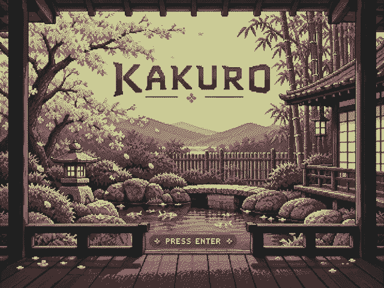
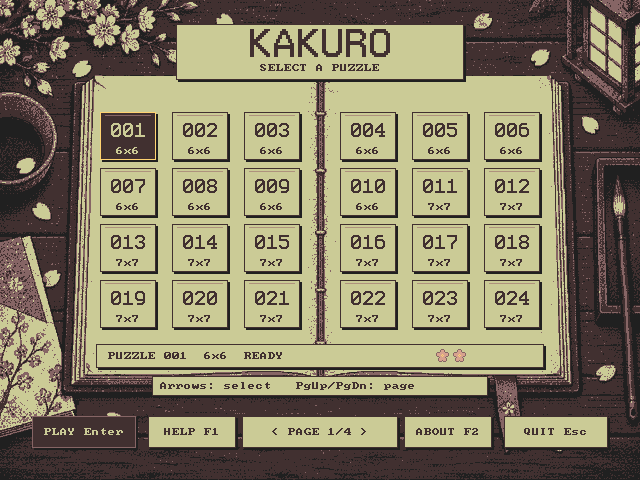
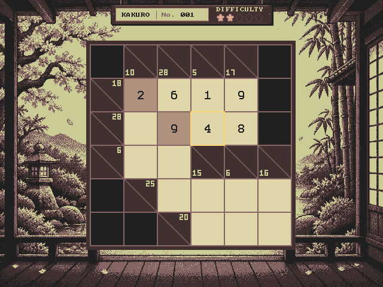

# MSDOS Kakuro

A Kakuro game for MS-DOS with 96 puzzles, a courtyard setting, and
640×480 VGA graphics in 16 colors.

* [Play in your browser](https://ifilot.github.io/msdos-kakuro/)
* [Download the DOS edition](https://github.com/ifilot/msdos-kakuro/releases)
* [Changelog](CHANGELOG.md)

## Screenshots

The courtyard start screen.

The puzzle journal, with board sizes and blossom difficulty indicators.

A puzzle in progress, with sum clues, fixed hints and entered digits.

## Getting started

**In your browser:** open the website and choose **Run the DOS game**.
Click the game to focus the keyboard, then press Enter to open the puzzle
journal. Touch controls are available on smaller screens. Use **Sound off**
to enable audio, or **Fullscreen** for a larger display.

**On DOS:** download `KAKURO.ZIP` from a release and extract all files into
one directory. Run `KAKURO.EXE`, keeping `KAKURO.DAT`, `PUZZLES.DAT` and
`SOUND.DAT` beside it. The game requires an 8086 or newer processor and a VGA
card. You can also run it in DOSBox or DOSBox-X.

In the journal, select a puzzle with the arrow keys and press Enter to play.
Each card shows the puzzle's size; filled cherry blossoms indicate its
difficulty. Played and solved markers track your progress during the session.

## Rules

1. Fill each empty answer cell with a digit from **1 to 9**.
2. Match each clue's sum: the number in the **upper right** of a diagonal
   clue cell applies to the run to its right; the number in the **lower left**
   applies to the run below it.
3. **Do not repeat a digit within a run.** Every horizontal and vertical run
   must satisfy its own clue.

For example, a three-cell run with clue 16 could contain **3, 5, 8**.
**4, 4, 8** also sums to 16, but repeats a digit and is invalid.

Rose-brown answer cells are fixed hints and cannot be edited. When all cells
are filled and every run satisfies the rules, the game displays a
congratulations message. Any valid solution is accepted.

## Controls

| Key | Action |
| --- | --- |
| Arrow keys | Select a puzzle or move the board selector. |
| Enter | Open the journal, start a puzzle, or dismiss the solved message. |
| Page Up / Page Down | Change journal pages. |
| 1–9 | Enter or replace a digit. |
| Backspace / Delete / 0 | Clear the selected answer cell. |
| Escape | Close a modal, return to the journal, or quit from the journal. |
| F1 / F2 | Open Help / About from the journal. |
| F3 | Open audio settings in the journal or during a puzzle. |

## Sound

Sound is optional. The DOS edition supports **AdLib**, **Sound Blaster FM**
and **MPU-401 General MIDI**. MIDI playback requires a connected General MIDI
synthesizer. Automatic detection selects available hardware; F3 lets you choose
a device, toggle music and effects, and save your sound preferences.

The browser edition supports AdLib and Sound Blaster FM and starts muted.

## Progress

Entries and played/solved markers last for the current session. Returning to
the journal and reopening the active puzzle preserves your entries. Selecting
a different puzzle starts a fresh board. Quitting or restarting clears progress;
there is no saved-game feature yet.

## Building and contributing

See the [developer guide](docs/DEVELOPMENT.md) for build instructions, tests,
asset formats, implementation notes, and release or website deployment.

## License

The game and its original graphics and sound assets are licensed under
[GNU GPLv3](LICENSE). Third-party fonts and tools retain their own licenses;
see [licensing and attribution](NOTICE.md).
